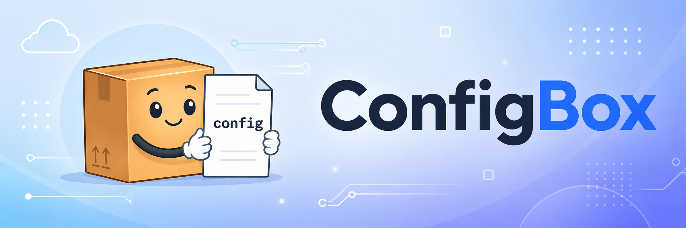
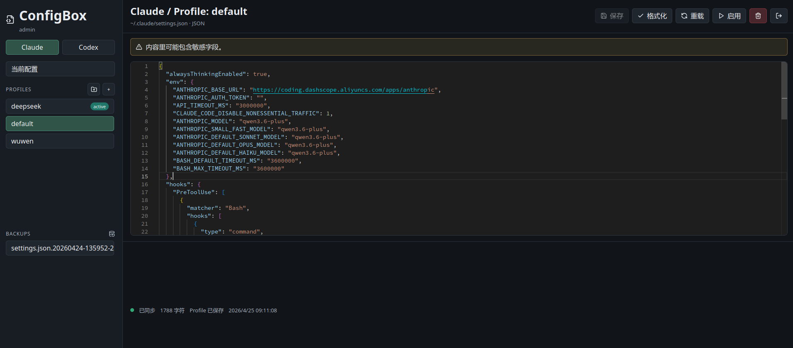

<div align="center">
  
  <h1>ConfigBox: Web端的Claude Code & Codex配置可视化切换工具</h1>
  
  
  
</div>

ConfigBox是一个Docker化Web管理工具，用于可视化管理claude code和codex工具配置文件，方便轻松修改配置和切换配置。同时，支持第三方模型接入Codex。

**ConfigBox同时适用于本地和Linux服务器上的配置切换管理！**

## 最近更新
:loudspeaker: 2026.05.06  发布v0.2.0, 优化了codex的配置方式

:loudspeaker: 2026.05.07  发布v0.3.0, 新增Codex Gateway，内置基于[Cmochance/codex-app-transfer](https://github.com/Cmochance/codex-app-transfer)的codex转发能力，支持没有实现response协议的国模接入codex

:loudspeaker: 2026.05.07  发布v0.3.3, 修复Codex Gateway转发MiniMax模型消息时的报错，修复前端错误

## 项目截图
  

## 安装方式

ConfigBox支持两种安装方式：

- 使用已经发布的Docker镜像
- 从源码在本机服务器上直接构建镜像

## 方式一：使用已发布的 Docker 镜像

创建一个镜像部署目录：

```bash
mkdir -p ~/configbox
cd ~/configbox
```

准备宿主机配置目录：

```bash
mkdir -p ~/.claude ~/.codex ~/.configbox
[ -f ~/.claude/settings.json ] || printf '{}\n' > ~/.claude/settings.json
[ -f ~/.codex/auth.json ] || printf '{}\n' > ~/.codex/auth.json
[ -f ~/.codex/config.toml ] || touch ~/.codex/config.toml
```

创建 `.env` 文件：

```bash
cat > .env <<EOF
UID=$(id -u)
GID=$(id -g)
APP_USERNAME=admin
APP_PASSWORD=
APP_PASSWORD_HASH=
SESSION_SECRET=
APP_COOKIE_SECURE=false
BACKUP_RETENTION=50
TZ=Asia/Shanghai
EOF
```

生成登录密码哈希和 Session Secret：

```bash
docker run --rm -it --user "$(id -u):$(id -g)" -v "$PWD:/work" cloudcollector/configbox:latest \
  python -m app.password_hash --env-file /work/.env
```

命令会提示输入两次登录密码，然后自动更新 `.env`：

```env
APP_PASSWORD=
APP_PASSWORD_HASH=...
SESSION_SECRET=...
```

创建 `docker-compose.yml`：

```yaml
services:
  configbox:
    image: cloudcollector/configbox:latest
    container_name: configbox
    restart: unless-stopped
    env_file:
      - .env
    user: "${UID:-1000}:${GID:-1000}"
    ports:
      - "8787:8787"
      - "127.0.0.1:18080:18080"
    environment:
      TZ: ${TZ:-Asia/Shanghai}
      APP_HOST: 0.0.0.0
      APP_PORT: 8787
      APP_USERNAME: ${APP_USERNAME:-admin}
      APP_COOKIE_SECURE: ${APP_COOKIE_SECURE:-false}
      CLAUDE_CONFIG_PATH: /config/claude/settings.json
      CODEX_CONFIG_PATH: /config/codex/auth.json
      CODEX_CONFIG_TOML_PATH: /config/codex/config.toml
      CODEX_GATEWAY_HOST: 0.0.0.0
      CODEX_GATEWAY_PORT: 18080
      CODEX_GATEWAY_PUBLIC_HOST: 127.0.0.1
      GATEWAY_LOG_MAX_MB: 50
      DATA_DIR: /data
      BACKUP_RETENTION: ${BACKUP_RETENTION:-50}
    volumes:
      - ${HOME}/.claude:/config/claude
      - ${HOME}/.codex:/config/codex
      - ${HOME}/.configbox:/data
```

启动：

```bash
docker compose up -d
```

如果你的服务器使用旧版 Compose 命令：

```bash
docker-compose up -d
```

## 方式二：从源码构建镜像

这种方式适合需要自行修改代码、二次开发或本地构建镜像的用户。

进入源码目录：

```bash
cd configbox
```

准备宿主机配置目录：

```bash
mkdir -p ~/.claude ~/.codex ~/.configbox
[ -f ~/.claude/settings.json ] || printf '{}\n' > ~/.claude/settings.json
[ -f ~/.codex/auth.json ] || printf '{}\n' > ~/.codex/auth.json
[ -f ~/.codex/config.toml ] || touch ~/.codex/config.toml
```

创建 `.env`：

```bash
cp .env.example .env
sed -i "s/^UID=.*/UID=$(id -u)/" .env
sed -i "s/^GID=.*/GID=$(id -g)/" .env
```

先构建镜像：

```bash
docker compose build
```

如果你的服务器使用旧版 Compose 命令：

```bash
docker-compose build
```

生成登录密码哈希和 Session Secret：

```bash
docker run --rm -it --user "$(id -u):$(id -g)" -v "$PWD:/work" configbox:latest \
  python -m app.password_hash --env-file /work/.env
```

命令会自动更新 `.env`：

```env
APP_PASSWORD=
APP_PASSWORD_HASH=...
SESSION_SECRET=...
```

启动：

```bash
docker compose up -d
```

旧版 Compose：

```bash
docker-compose up -d
```

访问：

```text
http://服务器IP:8787
```

## 环境变量

`.env.example` 示例：

```env
UID=1000
GID=1000
APP_USERNAME=admin
APP_PASSWORD=
APP_PASSWORD_HASH=
SESSION_SECRET=
APP_COOKIE_SECURE=false
BACKUP_RETENTION=50
TZ=Asia/Shanghai
NPM_REGISTRY=https://registry.npmmirror.com
PIP_INDEX_URL=https://mirrors.aliyun.com/pypi/simple/
CODEX_GATEWAY_HOST=0.0.0.0
CODEX_GATEWAY_PORT=18080
CODEX_GATEWAY_PUBLIC_HOST=127.0.0.1
GATEWAY_LOG_MAX_MB=50
```

推荐认证配置：

```env
APP_USERNAME=admin
APP_PASSWORD=
APP_PASSWORD_HASH=pbkdf2_sha256$$...
SESSION_SECRET=一串长随机字符串
```

临时测试也可以使用明文密码：

```env
APP_USERNAME=admin
APP_PASSWORD=your_password
APP_PASSWORD_HASH=
SESSION_SECRET=一串长随机字符串
```

长期使用推荐 `APP_PASSWORD_HASH`，不要使用明文 `APP_PASSWORD`。

## 远程访问

`docker-compose.yml` 默认暴露：

```yaml
ports:
  - "8787:8787"
  - "127.0.0.1:18080:18080"
```

可以通过服务器 IP 访问，或者转发端口访问：

```text
http://服务器IP:8787
```

Codex Gateway 默认只把宿主机 `127.0.0.1:18080` 映射到容器，供同一台机器上的 Codex CLI / VS Code Codex 插件访问。若在远程服务器上使用 VS Code Remote，请确保 Codex 插件运行在同一台远程机器，或通过 VS Code Ports / SSH 隧道转发 `18080`。

如果使用 HTTPS 反向代理，请设置：

```env
APP_COOKIE_SECURE=true
```

如果使用普通 HTTP、SSH 隧道、VS Code Ports 转发，请保持：

```env
APP_COOKIE_SECURE=false
```

## 使用教程

### 查看当前配置


左侧选择 `Claude` 或 `Codex`，点击 `当前配置`。

这里编辑的是当前真实生效配置：

```text
Claude -> ~/.claude/settings.json
Codex  -> ~/.codex/auth.json + ~/.codex/config.toml
```

点击 `保存` 时，系统会：

```text
校验 JSON/TOML -> 备份旧版本 -> 原子写入新版本
```

如果文件在页面打开后被外部终端修改，保存时会提示冲突，避免覆盖外部修改。

### 配置切换和Profiles

Profile是你主动保存的配置方案，可保存多套可切换配置。

例如，你可以有命名为以下名称的多套配置：

```text
default
qwen_coding_plan
glm_coding_plan
mimo_token_plan
deepseek_api
```

Profile默认存放在：

```text
~/.configbox/profiles/claude/
~/.configbox/profiles/codex/
```

点击某个`Profile`后可以编辑它。点击 `启用` 时，系统会把该 `Profile`覆盖到真实配置文件中，完成配置切换。

Codex 的一个 Profile 会同时保存 `auth.json` 和 `config.toml`，启用时也会成组覆盖这两个真实配置文件。

### Codex Gateway

左侧选择 `Codex`，点击 `Gateway`。

Gateway 用于把 Codex 的 Responses API 请求转发到 OpenAI Chat 兼容上游。典型流程：

```text
添加 Provider -> 启动 Gateway -> 在 Codex / VS Code Codex 插件中使用
```

点击 `Provider` 可以一次性填写名称、Base URL、API Key、模型映射和鉴权方式。Provider 支持启用、编辑、删除。

点击 `启动` 时，ConfigBox 会：

```text
清空上次 Gateway 日志 -> 启动本地 codex-gateway -> 自动写入 ~/.codex/auth.json 与 config.toml
```

点击 `停止` 时，ConfigBox 会：

```text
停止本地 codex-gateway -> 自动恢复启动前的 Codex 配置
```

如果 ConfigBox 或容器异常退出，下次启动时会检测残留快照；若 Gateway 未运行，会自动恢复 Codex 原配置，避免 Codex 继续指向已经关闭的网关。

Gateway 日志存放在：

```text
~/.configbox/codex-gateway/logs/
```

默认最多保留 `50MB`，可通过 `GATEWAY_LOG_MAX_MB` 调整；ConfigBox 启动和 Gateway 启动时都会清空旧日志，页面内也提供清除日志按钮。

### 备份与Backups

Backups是系统自动保存的历史版本。

每次执行以下操作前都会自动备份：

```text
保存当前配置
启用Profile
恢复备份
```

备份目录：

```text
~/.configbox/backups/claude/
~/.configbox/backups/codex/
```

如果配置改坏了，可以在 `Backups` 中选择历史版本并点击 `恢复`。

## 数据挂载

容器内路径：

```text
/config/claude/settings.json
/config/codex/auth.json
/config/codex/config.toml
/data
/data/codex-gateway/config.json
/data/codex-gateway/logs/
```

宿主机映射：

```text
${HOME}/.claude             -> /config/claude
${HOME}/.codex              -> /config/codex
${HOME}/.configbox          -> /data
${HOME}/.configbox/codex-gateway/config.json -> /data/codex-gateway/config.json
```

## API 验证

API 仍支持 Basic Auth，便于命令行检查：

```bash
curl -u admin:你的密码 http://127.0.0.1:8787/api/tools
curl -u admin:你的密码 http://127.0.0.1:8787/api/configs/codex/active
```

浏览器 UI 使用 `/api/login` 和 HttpOnly Cookie。

## 常见问题

如果容器反复重启并提示 `/data` 权限错误，检查 `.env` 中的 UID/GID 是否与当前用户一致：

```bash
id -u
id -g
```

然后修改：

```env
UID=你的UID
GID=你的GID
```

如果登录成功后又变回未登录，检查：

```env
APP_COOKIE_SECURE=false
```

普通 HTTP 下不能设置为 `true`。只有 HTTPS 下才应设置为 `true`。

如果 Docker 构建时依赖下载慢，可以修改：

```env
NPM_REGISTRY=
PIP_INDEX_URL=
```

## 安全说明

ConfigBox 能查看和编辑敏感配置文件，请把它当作管理员工具使用。

建议：

- 使用 `APP_PASSWORD_HASH`，不要长期使用明文 `APP_PASSWORD`
- 使用强随机 `SESSION_SECRET`
- 公网部署时使用 HTTPS
- 尽量通过防火墙、安全组限制访问来源

## 致谢与社区支持

- ConfigBox的Codex Gateway转发能力基于[Cmochance/codex-app-transfer](https://github.com/Cmochance/codex-app-transfer)。感谢作者对开源的贡献。

<a href="https://linux.do">
  
</a>
